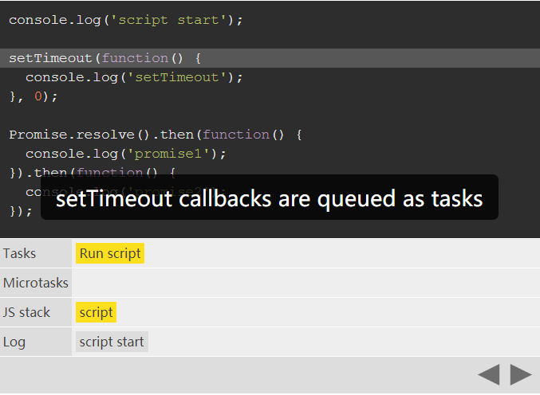

# JS Event Loop 和 Microtask Macrotask
针对以下面试题的一次强化学习（敲黑板！！）
> 面试题：setTimeout、Promise、Async/Await 的区别

## 2. 基础知识
需要先看懂这两份资料，他们会让你构建一个完整的从 上下文执行栈，Event Loop,任务队列(task queue)，再到Microtask（微任务）、Macrotask/Task（宏任务）知识体系。看完这个来解决一些setTimeout,pormsie,async 的执行先后问题，简直都是毛毛雨！
### js运行原理 
首先补齐基础，来看一下js 引擎（如：V8）的运行原理，这位Philip Roberts小哥讲的非常好，运行过程都使用动画展现，过程非常生动，条理也很清楚，当然ppt也做的不错。
这是B站上带英文字幕的版本
[视频地址](https://www.bilibili.com/video/av37759434/)

这个是核心思想的截图


### Microtask、Macrotask/Task
Philip Roberts视频中缺少了任务队列(task queue)区分为Microtask（微任务）、Macrotask/Task（宏任务）的部分，这里需要看第二份资料，详细的介绍了Microtask、Macrotask/Task 的运行过程，且分析了浏览器的执行差异,[Jake Archibald英文博客地址](https://jakearchibald.com/2015/tasks-microtasks-queues-and-schedules/)。



看博客注意事项
- 博客内有带执行步骤的动画，一定要亲自点一下:star:
- 博客中将Macrotask叫做Task；
- 分析浏览器差异的部分基本可以略过了，随着版本更新，这些差异基本都被修补了。我们只要看博客中关于chrome浏览器的正确输出结果就可以了

Microtask和Macrotask所包含的api：
    Microtask
    - process.nextTick
    - promise
    - Object.observe (废弃)
    - MutationObserver

    Macrotask
    - setTimeout
    - setImmediate
    - setInterval
    - I/O
    - UI 渲染
  
如果不想看英文博客，我在这里作一点简单的总结：
1. 在执行上下文栈的同步任务执行完后；
2. 首先执行Microtask队列，按照队列`先进先出`的原则，一次执行完所有Microtask队列任务；
3. 然后执行Macrotask/Task队列，一次执行一个，一个执行完后，检测 Microtask是否为空；
4. 为空则执行下一个Macrotask/Task；
5. 不为空则执行Microtask

## 2. 看题
```js
    // 今日头条面试题
    async function async1() {
        console.log('async1 start')
        await async2()
        console.log('async1 end')
    }
    async function async2() {
        console.log('async2')
    }
    console.log('script start')
    setTimeout(function () {
        console.log('settimeout')
    })
    async1()
    new Promise(function (resolve) {
        console.log('promise1')
        resolve()
    }).then(function () {
        console.log('promise2')
    })
    console.log('script end')
```
题目的本质，就是考察setTimeout、promise、async await的实现及执行顺序，以及JS的事件循环的相关问题。

答案：
```
    script start
    async1 start
    async2
    promise1
    script end
    async1 end
    promise2
    settimeout
```
再看一个经典的例子：
```js
    const p = Promise.resolve();
    (async () => {
        await p;
        console.log('await end');
    })();
    p.then(() => {
        console.log('then 1');
    }).then(() => {
        console.log('then 2');
    });
```
答案：
```
    then 1
    then 2
    await end
```
这时候是不是会感觉会轻松许多？


## reference
1. [浏览器的Tasks、microtask、 queues 和 schedules](https://github.com/sisterAn/blog/issues/21)
2. [HTML系列：macrotask和microtask](https://zhuanlan.zhihu.com/p/24460769)
3. [Event loop 及 macrotask & microtask（有视频）](https://zhuanlan.zhihu.com/p/76131519)
4. [JavaScriptCore的MacroTask及MicroTask源码解析](https://zhuanlan.zhihu.com/p/63912129)
5. [HTML Living Standard](https://html.spec.whatwg.org/multipage/webappapis.html#event-loops)
6. [并发模型与事件循环 MDN](https://developer.mozilla.org/zh-CN/docs/Web/JavaScript/EventLoop)
7. [拆解JavaScript中的异步模式](https://zhuanlan.zhihu.com/p/67815990)
8. [Tasks, microtask, queues and schedules :star:](https://jakearchibald.com/2015/tasks-microtasks-queues-and-schedules/)